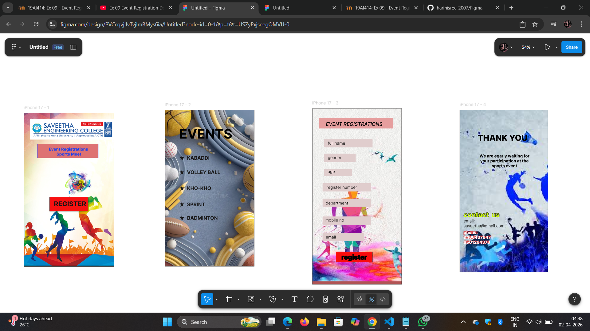

# Ex08 Event Registration Web Application
## Date:02.04.2026

## AIM:
To design, develop and deploy a web application for event registration using Figma UI tool.

## UI DESIGN TOOL:
Figma

## DESIGN STEPS:

### Step 1:
Use frames to represent screens or sections.

### Step 2:
Add column grids for consistent spacing and alignment.

### Step 3:
Insert shapes, text, buttons, and icons.

### Step 4:
Use Auto Layout for flexible, responsive design.

### Step 5:
Define color, text, and effect styles globally for consistency.

### Step 6:
Name layers logically and group related elements.

### Step 6:
Link frames to show navigation or interactions.

### Step 7:
Select the specific frame while generating code using Anima plugin.

## CODE:
```

<!DOCTYPE html>
<html>
  <head>
    <meta name="viewport" content="width=device-width, initial-scale=1" />
    <meta charset="utf-8" />
    <link rel="stylesheet" href="globals.css" />
    <link rel="stylesheet" href="style.css" />
  </head>
  <body>
    <div class="image">
      
    </div>
  </body>
</html>
```
```
<!DOCTYPE html>
<html>
  <head>
    <meta name="viewport" content="width=device-width, initial-scale=1" />
    <meta charset="utf-8" />
    <link rel="stylesheet" href="globals.css" />
    <link rel="stylesheet" href="style.css" />
  </head>
  <body>
    <div class="iphone">
      
      
      
      <div class="EVENTS">&nbsp;&nbsp;&nbsp;&nbsp;&nbsp;&nbsp;&nbsp;&nbsp;&nbsp;&nbsp;&nbsp;&nbsp; EVENTS</div>
      
      
      
      
      <div class="text-wrapper">KABADDI</div>
      <div class="div">VOLLEY BALL</div>
      <div class="text-wrapper-2">KHO-KHO</div>
      <div class="text-wrapper-3">SPRINT</div>
      <div class="text-wrapper-4">BADMINTON</div>
    </div>
  </body>
</html>
```
```
<!DOCTYPE html>
<html>
  <head>
    <meta name="viewport" content="width=device-width, initial-scale=1" />
    <meta charset="utf-8" />
    <link rel="stylesheet" href="globals.css" />
    <link rel="stylesheet" href="style.css" />
  </head>
  <body>
    <div class="iphone">
      
      <div class="rectangle"></div>
      <div class="div"></div>
      
      <div class="text-wrapper">email</div>
      <div class="rectangle-2"></div>
      
      
      <div class="rectangle-3"></div>
      <div class="text-wrapper-2">full name</div>
      <div class="text-wrapper-3">gender</div>
      <div class="text-wrapper-4">age</div>
      <div class="text-wrapper-5">register number</div>
      <div class="text-wrapper-6">department</div>
      <div class="text-wrapper-7">mobile no</div>
      <div class="rectangle-4"></div>
      <div class="text-wrapper-8">register</div>
      <div class="rectangle-5"></div>
      <div class="text-wrapper-9">EVENT REGISTRATIONS</div>
    </div>
  </body>
</html>
```
```
<!DOCTYPE html>
<html>
  <head>
    <meta name="viewport" content="width=device-width, initial-scale=1" />
    <meta charset="utf-8" />
    <link rel="stylesheet" href="globals.css" />
    <link rel="stylesheet" href="style.css" />
  </head>
  <body>
    <div class="iphone">
      
      <div class="text-wrapper">THANK YOU</div>
      <p class="div">We are egarly waiting for your participation at the sports event</p>
      <div class="contact-us">contact&nbsp;&nbsp;us</div>
      <div class="email-saveetha-gmail">email:<br />saveetha@gmail.com</div>
      <div class="phone">phone:<br />9466437947<br />8501264378</div>
    </div>
  </body>
</html>
```

## OUTPUT:


## RESULT:
The program to design, develop and deploy a web application for event registration using Figma UI tool is completed successfully.
